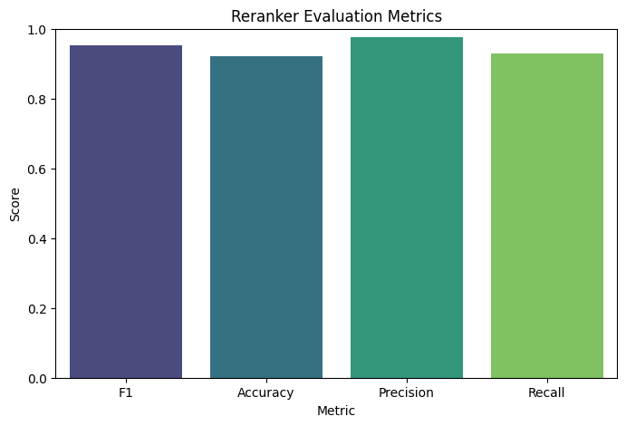
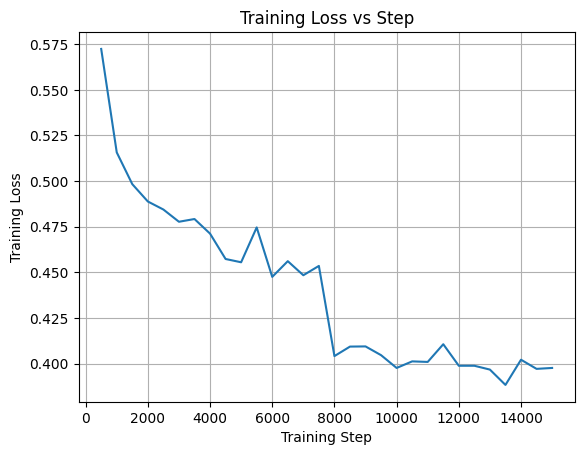

## Abstract

This project is an AI-powered search system designed to retrieve and synthesize relevant biomedical research papers from PubMed. The system reranks and summarizes scientific literature to help researchers quickly find and understand key findings across multiple studies. By fine-tuning a BioBERT-based cross-encoder on biomedical question-answer pairs and integrating a BART summarization model, this project aims to deliver concise, relevant answers to complex research queries. The system achieves improved relevance ranking over baseline keyword search while maintaining fast query response times.

## Overview

### The Problem

Biomedical researchers face an overwhelming volume of scientific literature, with millions of papers published annually on PubMed alone. Traditional keyword-based search often returns hundreds of results, requiring researchers to manually read through abstracts to identify relevant studies. This process is time consuming and inefficient, particularly when trying to synthesize findings across multiple papers or answer specific research questions. The challenge is to build a system that not only retrieves relevant papers but also understands semantic relationships between queries and documents, then presents findings in a digestible format.

### Why This Problem Matters

Efficient literature search is critical for advancing scientific research and evidence-based medicine. Researchers need to quickly identify relevant prior work to avoid duplicating studies, build on existing knowledge, and make informed decisions. In clinical settings, healthcare professionals require rapid access to the latest research to inform treatment decisions. A more intelligent search system can accelerate scientific discovery, improve research quality, and ultimately contribute to better health outcomes.

### Proposed Approach

This project employs a three-stage pipeline: 

1. Initial retrieval using PubMed's search API with query preprocessing.

2. Reranking using a fine-tuned BioBERT cross-encoder to score query-document relevance.

3. Extractive summarization using DistilBART to condense findings from top-ranked papers.

### Rationale

Prior work in biomedical information retrieval has shown that domain-specific language models (like BioBERT) outperform general-purpose models due to their training on medical literature. Cross-encoders, which jointly encode query and document pairs, have demonstrated superior performance over bi-encoders for reranking tasks, though at higher computational cost. Our approach differs from existing systems by integrating reranking with multi-document summarization, providing not just a ranked list but synthesized insights. I chose DistilBART for summarization due to its balance of speed and quality, making the system practical for real-time use.

### Key Components

The system consists of three main components: 
1. A PubMed knowledge base interface that retrieves initial candidates.

2. A BioBERT-based reranker fine-tuned on BioASQ question-answer pairs.

3. A DistilBART summarizer that processes each abstract individually before presenting their brief summaries. 
    
### Result Components
List of top papers where each paper has:
- Title
- Relevance score
- Source ID
- Brief summary

## Approach

### Methodology

The overall methodology follows a retrieves then rerank system. First, we preprocess queries and removes stopwords to improve search. These candidates from the inital retrieval are then passed to a trained reranker that computes semantic similarity scores between the query and each paper's title and abstract. Finally, the top 5 reranked papers are summarized individually using a summarization model, with results presented to the user in ranked order.

### Algorithm/Model

**Reranker**: BioBERT-based cross-encoder (dmis-lab/biobert-base-cased-v1.1) was used and fine-tuned on the BioASQ 12B dataset. The model takes [query, document] pairs as input and outputs a relevance score. Training uses binary cross-entropy loss with positive pairs from question-answer matches and hard negatives. Hard negatives are generated by computing TF-IDF similarity between each query and the corpus, selecting high-similarity but non-relevant documents as negatives. This forces the model to learn distinctions between relevant and superficially similar documents.

**Summarizer**: DistilBART-CNN-12-6, a distilled version of BART so it can perform faster, was employed to produce concise 2-3 sentence summaries for each paper.

### Assumptions and Design Choices

- **Assumption**: PubMed's initial retrieval has relevant papers in the top 20
- **Choice**: BioBERT over general BERT domain-specific pretraining improves biomedical understanding

### Limitations

- **Coverage**: Due to time, the model only searches PubMed and does not include papers in other databases, although extending it to include that functionality is not difficult. 
- **Query understanding**: Effective queries partly depend on the user.

## Experiments

### Dataset

**Training Data**: BioASQ 12B question-answer-passages dataset, containing biomedical questions paired with relevant text snippets from PubMed abstracts.

**Corpus Statistics**: 
- Training set: 5,049 questions from BioASQ 12B dev split
- Evaluation set: 340 questions from BioASQ 12B eval split
- Positive pairs: ~60,000
- Negative pairs: ~60,000 
- Total training samples: ~120,000 pairs

### Implementation

**Models**:
- Reranker: BioBERT cross-encoder (dmis-lab/biobert-base-cased-v1.1)
- Summarizer: DistilBART-CNN-12-6 (sshleifer/distilbart-cnn-12-6) (untrained)

**Parameters For Cross-Encoder**:
- Batch size: 1024
- Epochs: 2
- Warmup steps: 100

**Computing Environment**:
- Platform: Google Colab Pro (Student)
- Hardware: A100 GPU + High-RAM

### Model Architecture

**Cross-Encoder Reranker**:
- Base model: BioBERT (BERT-base architecture with 12 layers, 768 hidden dimensions, 12 attention heads)
- Pre-trained on: PubMed abstracts and PMC full-text articles
- Input: Concatenated [CLS] query [SEP] document [SEP] tokens (max 512 tokens)
- Output: Single relevance score via classification head
- Parameters: ~110M

**Summarizer**:
- Base model: DistilBART-CNN-12-6 (distilled BART with 12 encoder layers, 6 decoder layers)
- Pre-trained on: CNN/DailyMail dataset
- Input: Abstract text
- Output: 2-3 sentence summary
- Parameters: ~306M (distilled from 406M)

## Results

The fine-tuned BioBERT cross-encoder demonstrates strong performance on the BioASQ 12B evaluation set:

F1 Score:
Accuracy: 
Percision:
Recall:

### Parameter Choices

1. **Batch Size (1024)**:
   - Chosen to maximize GPU utilization on A100
   - Smaller batches increased training time without performance gains

2. **Epochs (2)**:
   - Model converged after 2 epochs based on training loss
   - Additional epochs showed signs of overfitting on validation set
   - Training time: ~30 minutes for 2 epochs

3. **Warmup Steps (100)**:
   - Represents ~1.3% of total training steps
   - Prevents early training instability and improves convergence
   - Standard practice for transformer fine-tuning

## Discussion

### Comparison with Existing Approaches
This model ranks papers by relevance more accuratly than PubMed's search engine. 

Example prompt:

PubMed's ranking:

Model's ranking:

### Future Directions

1. Query Reformulation: Add a query expansion module to automatically add synonyms and related terms to the query.

2. Larger Training Set: Train on more datasets with more compute resources to improve reranker.

3. Comprehensive Database: Instead of calling PubMed's API, download its full data with a mechansim to update it daily.

4. Citation Network: Incorporate citation relationships to boost papers that are highly cited by other relevant papers

5. Broader Coverage: Extend beyond PubMed to include other databases (bioRxiv, medRxiv).

## Conclusion

## References

